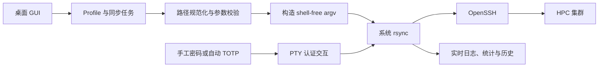

# NJU-HPC Sync

## 把 HPC 文件同步，变成一次可确认、可追踪的操作


> 在本地工作站与 HPC 集群之间，建立一条看得见、确认过、可追溯的文件通道。

NJU-HPC Sync 是一款面向 Linux 的 HPC 文件同步桌面应用。它把研究者反复输入的 `rsync` 命令、SSH 认证、TOTP 验证和传输结果，收拢成一套清晰的图形化工作流：选择任务，预览变化，确认风险，开始同步。

它不试图替代 HPC，也不把文件交给第三方云服务。它做的事情很专注：让本地目录与远程集群目录之间的可靠同步，变得更容易开始、更不容易误操作，也更方便在下一次继续。

当前版本：`1.0.2`

## 一句话看懂它

```text
本地目录  ←→  HPC 集群目录
             ↑
      rsync + OpenSSH
             ↑
       NJU-HPC Sync GUI
```

如果你熟悉下面这类命令：

```bash
rsync -avzP --stats --itemize-changes -- \
  /path/to/local/project/ \
  hpc-alias:/path/to/remote/project/
```

那么 NJU-HPC Sync 就是它的桌面化工作流：参数仍然由 `rsync` 执行，连接仍然由 OpenSSH 建立，但目录、方向、认证、预览、日志和历史都有了明确的位置。

## 为什么需要它

HPC 文件同步往往不是“复制几个文件”这么简单：

- 本地和远程路径容易写错，目录末尾的 `/` 还会改变同步语义；
- 普通同步与镜像同步的风险不同，`--delete` 不应该被无意触发；
- SSH 密码、键盘交互和 TOTP 验证码经常打断命令行流程；
- 一次同步失败后，用户需要知道是连接失败、认证失败，还是部分文件传输失败；
- 同一个项目会反复同步，临时命令很难复用，也很难回看。

NJU-HPC Sync 将这些步骤组织成一个可以重复执行的任务模型：

```text
保存一次任务配置
        ↓
选择同步方向与模式
        ↓
预览将要发生的变化
        ↓
确认后执行传输
        ↓
查看实时结果与历史记录
```

## 产品体验

### 1. 双向同步，围绕真实工作流设计

- `Local → NJU-HPC`：把本地代码、数据或结果上传到集群。
- `NJU-HPC → Local`：把远程结果、日志或中间产物下载回本地。
- 同步按“目录内容”处理，程序会自动规范化目录路径，降低尾部 `/` 带来的歧义。
- 可以保存可复用的 Profile，也可以不创建 Profile，直接执行一次临时任务。

### 2. 普通同步与强制镜像，风险清楚可见

- 普通同步使用 `rsync -avzP`，保留增量传输、进度和统计信息。
- 强制镜像在此基础上使用 `--delete`，让目标目录与源目录保持一致。
- 两种模式都支持 `--dry-run` 预览。
- 镜像同步执行前强制预览并确认，界面会明确显示预计删除的文件数量。

### 3. 认证不再是工作流的断点

- 支持手工输入完整认证密码。
- 支持固定密码与 TOTP Secret 的自动认证。
- 自动模式只在 SSH 真正出现认证提示时生成当前 TOTP，避免过早生成导致验证码过期。
- 支持 SHA1、SHA256、SHA512，以及可配置的 TOTP 周期和位数。
- 预览与正式同步连续执行时，运行期防重用机制避免重复提交同一个已使用的 TOTP 时间窗口。

### 4. 每一次同步都有反馈

- 实时显示连接、认证、预览、传输、成功、失败和取消状态。
- 显示当前输出、文件统计、数据量、耗时和变更明细。
- 支持停止当前任务、清空日志、复制日志和保存日志。
- SQLite 保存 Profile、同步历史和详细日志，默认保留 60 天，可在“日志管理”中调整。
- 对常见的 `rsync`/SSH 退出码提供更容易理解的提示，例如部分传输失败、源文件消失和认证失败。

## 工作原理：熟悉的系统工具，清晰的桌面控制层



核心原则很简单：

1. GUI 负责收集任务、校验输入和呈现状态。
2. 程序把路径和选项组装成独立的参数列表，不经过 shell，不把用户输入拼进 shell 命令字符串。
3. `rsync` 负责增量传输、压缩、进度和文件统计。
4. OpenSSH 负责连接、主机别名、端口、跳板机等 SSH 能力。
5. PTY runner 负责处理 SSH 的交互式认证提示，并将认证信息从日志中脱敏。

因此，Profile 中只保存 SSH Host 别名，例如 `hpc-alias`。程序不会复制、改写或重新维护 `~/.ssh/config`；HostName、User、Port、ProxyJump 等连接策略继续由系统 OpenSSH 配置决定。

## 安全边界：凭据留在本机，动态密码不进入任务记录

NJU-HPC Sync 将“连接能力”和“凭据数据”分开处理：

- 固定密码和 TOTP Secret 保存在用户配置目录下的独立凭据文件中，目录权限为 `700`，文件权限为 `600`。
- 完整的动态密码只在 SSH 认证提示出现时生成并发送，不写入命令行、环境变量、SQLite 历史或日志。
- 日志输出会对已知敏感值进行脱敏，认证失败信息不会显示实际密码或验证码。
- 停止操作只向本次启动的 `rsync` 进程组发送信号，不影响其他终端中的同步任务。

请始终把本地凭据文件当作私密数据，不要将其复制到项目目录或提交到 Git 仓库。

## 三步开始一次同步

### 第一步：准备 SSH Host

先确保系统 OpenSSH 可以通过 Host 别名连接目标集群。应用只需要这个别名，不需要你在应用中重复填写 SSH 的底层连接参数。

### 第二步：创建凭据与 Profile

在“管理 → 凭据管理”中配置自动 TOTP 凭据，或选择手工认证。然后新建 Profile，填写：

```text
Profile:      我的 HPC 项目
Local:        /path/to/local/project
Remote Host:  hpc-alias
Remote Path:  /path/to/remote/project
```

选择同步方向和模式后保存。路径示例仅用于说明格式，请替换成你自己的目录。

### 第三步：预览，再执行

先点击“预览”检查文件变化；如果使用强制镜像，确认待删除数量后再点击“开始同步”。同步过程中的状态、日志和统计信息会直接显示在主界面，并自动写入历史记录。

## 安装、运行与测试

下面的内容面向希望从源码运行或参与开发的用户。发布包构建说明见后文。

### 运行环境

- Linux/Ubuntu 桌面环境
- Python 3.11
- `rsync`
- OpenSSH client
- Conda（推荐使用项目提供的独立环境）

安装系统工具：

```bash
sudo apt install rsync openssh-client
```

创建项目环境：

```bash
conda env create -f environment.yml
```

如果环境已经存在，可以更新 Python 依赖：

```bash
conda run -n hpc-sync python -m pip install -r requirements.txt
```

### 启动应用

在项目根目录执行：

```bash
./run.sh
```

也可以直接运行：

```bash
conda run -n hpc-sync python main.py
```

### 运行测试

```bash
conda run -n hpc-sync pytest -q
conda run -n hpc-sync python -m compileall -q app main.py
```

测试覆盖命令参数构造、目录语义、特殊字符路径、TOTP RFC 向量、凭据权限、SQLite 历史、PTY 密码提示、取消流程和日志脱敏。没有真实 HPC 凭据时，可以使用手工认证或 fake SSH/rsync 做本地验证。

如果需要在无显示器环境中进行 Qt 检查，可设置：

```bash
QT_QPA_PLATFORM=offscreen conda run -n hpc-sync pytest -q
```

## 构建 Ubuntu `.deb` 安装包

发布包固定在 Ubuntu 22.04 amd64 环境构建，支持 Ubuntu 22.04 及以上版本。安装包内置 Python 和 Python 依赖，但继续使用系统的 `rsync` 与 OpenSSH。

安装构建依赖并打包：

```bash
conda run -n hpc-sync python -m pip install -r build-requirements.txt
./scripts/build_deb.sh
```

产物会写入 `release/`，同时生成 SHA-256 校验文件：

```text
release/nju-hpc-sync_<version>_amd64.deb
release/nju-hpc-sync_<version>_amd64.deb.sha256
```

本地安装：

```bash
sudo apt install ./release/nju-hpc-sync_1.0.2_amd64.deb
```

安装后可以从应用菜单启动，也可以运行：

```bash
nju-hpc-sync
```

Ubuntu 22.04 完成功能测试后，可以使用 Docker 对安装和无界面启动进行冒烟测试：

```bash
./scripts/smoke_test_deb.sh
```

## 本地数据位置

```text
~/.config/nju-hpc-sync/credentials.json
    固定密码与 TOTP Secret；目录权限 700，文件权限 600

~/.local/share/nju-hpc-sync/nju-hpc-sync.sqlite3
    Profile、同步历史和详细日志；不保存凭据
```

历史日志默认保留 60 天，可通过“管理 → 日志管理”修改；应用启动、设置变更和同步完成后会自动清理过期记录。

## 项目结构

```text
main.py                         # 应用入口
app/main_window.py              # 主窗口、线程与同步工作流
app/dialogs.py                  # Profile、凭据、认证、历史和设置对话框
app/rsync_command.py            # 参数构造与运行前检查
app/rsync_runner.py             # PTY runner、认证提示、取消和脱敏
app/auth.py                     # 手工/自动认证 provider
app/totp.py                     # TOTP 生成与运行期防重用
app/credential_store.py         # 凭据文件与权限控制
app/database.py                 # SQLite schema、Profile 和历史
app/models.py                   # 数据模型与同步状态
app/paths.py                    # 路径规范化和日志脱敏
tests/                          # 自动化测试
packaging/                      # Linux desktop、图标与安装配置
scripts/                        # deb 构建与冒烟测试脚本
```

## 当前明确不做什么

为了保持边界清晰，NJU-HPC Sync 当前不是：

- SFTP 客户端或完整文件管理器；
- 云盘或第三方中转服务；
- SSH 配置编辑器；
- 后台持续监听目录的自动同步守护进程。

它是一层专注的桌面控制界面：把本地目录与远程 HPC 目录之间的一次次 `rsync` 操作做得更清楚、更安全、更可复用。
